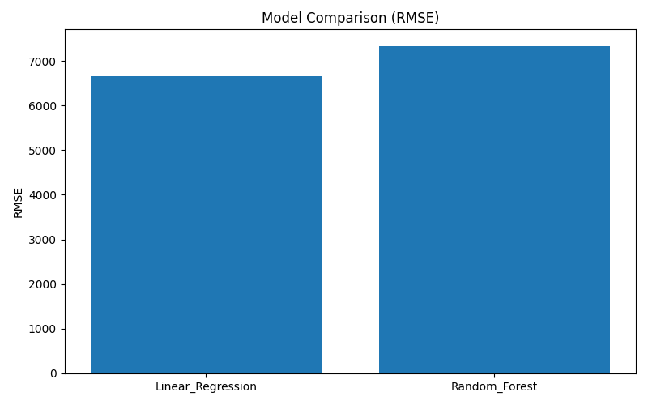
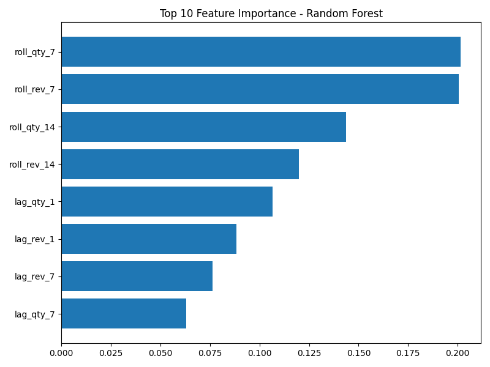
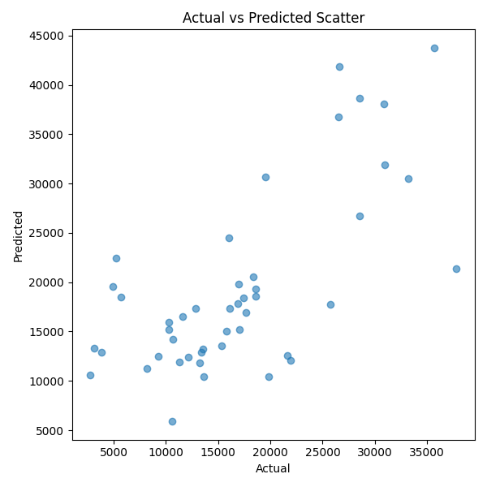
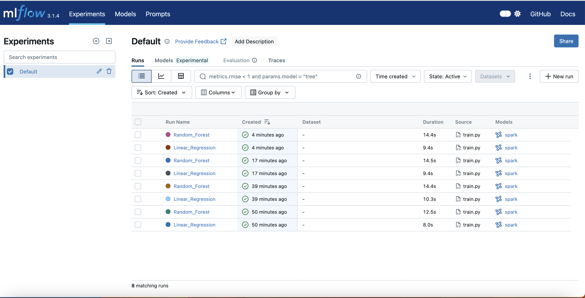
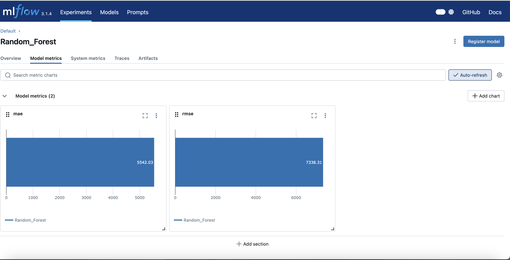
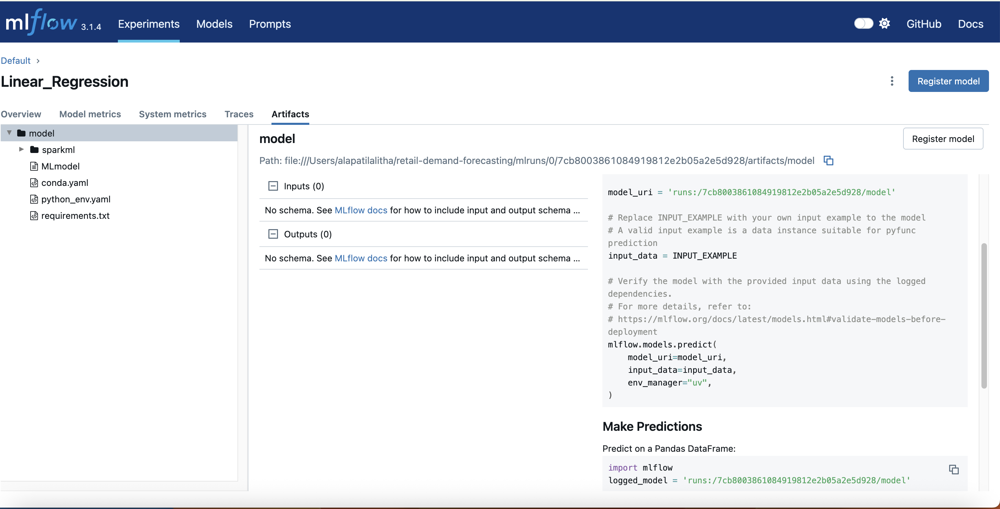

📊 Retail Demand Forecasting Pipeline
Scalable Spark + MLflow Forecasting System
🚀 Overview

Designed and implemented an end-to-end distributed retail demand forecasting system using PySpark, Spark SQL, and MLflow.

The system follows a Medallion Architecture (Bronze → Silver → Gold) to transform raw retail data into model-ready features and train predictive models for daily demand forecasting.

🔎 Core Capabilities

Distributed data processing using Spark

Time-series feature engineering with Spark SQL (LAG, rolling windows)

Multi-model training (Linear Regression & Random Forest)

MLflow experiment tracking

Automated evaluation & visualization

🏗 System Architecture
Raw Excel Data
      ↓
Bronze Layer (Raw Parquet)
      ↓
Silver Layer (Cleaned & Aggregated)
      ↓
Gold Layer (Spark SQL Feature Engineering)
      ↓
Model Training
      ↓
MLflow Tracking
      ↓
Reports & Visualizations

🧱 Tech Stack

PySpark

Spark SQL (Window Functions)

Spark MLlib

MLflow

Parquet

Pandas

Matplotlib

📂 Project Structure
📂 Project Structure

retail-demand-forecasting/
│
├── src/
│   ├── ingest.py
│   ├── transform.py
│   ├── features.py
│   ├── train.py
│   ├── visualize.py
│   └── main.py
│
├── reports/
├── notebooks/
│   └── archive/   # Experimental notebooks archived
│
├── requirements.txt
└── README.md

> 📌 Note: Experimental notebooks are archived for reference and exploratory analysis. The production pipeline is fully implemented in the `src/` directory.

⚙ Data Engineering Workflow
Bronze

Ingest raw Excel

Convert to Spark DataFrame

Store as Parquet

Silver

Data cleaning

Null handling

Daily aggregation

Validation checks

Gold

Feature engineering via Spark SQL

LAG-based time-series features

Rolling window aggregations

ML-ready dataset generation

🤖 Models & Evaluation

Models Implemented

Linear Regression

Random Forest Regressor

Metrics

RMSE

MAE

## Model Performance Summary

| Model             | RMSE   | MAE    |
|------------------|--------|--------|
| Linear Regression | 6660   | 5080   |
| Random Forest     | 7338   | 5542   |

Linear Regression performed slightly better on this dataset in terms of RMSE and MAE.

📈 Generated Reports

Model Comparison Chart

Feature Importance (Top 10)

Actual vs Predicted Scatter

Residual Plot

💼 Business Value

## Business Impact

This system demonstrates how retailers can:

- Forecast daily product demand
- Improve inventory planning accuracy
- Reduce stock-outs and overstock scenarios
- Optimize replenishment strategies
- Scale forecasting workflows using distributed computing

The architecture is designed to handle large retail transaction datasets in production environments.

▶️ How to Run
## How To Run

### 1. Create Virtual Environment
python -m venv venv  
source venv/bin/activate  

### 2. Install Dependencies
pip install -r requirements.txt  

### 3. Run Full Pipeline
python src/main.py  

### 4. Train Models
python src/train.py  

### 5. Generate Visualizations
python src/visualize.py  

### 6. Launch MLflow UI
mlflow ui  

Open in browser:
http://127.0.0.1:8000

🔥 Engineering Highlights

✔ Medallion Architecture
✔ Spark SQL window functions
✔ Modular pipeline design
✔ MLflow tracking
✔ Automated reporting

🚀 Future Improvements

Hyperparameter tuning

Cross-validation

Dockerization

Airflow orchestration

Model registry deployment

## 📊 Model Performance & Insights

### 🔹 Model Comparison

### 🔹 Feature Importance

### 🔹 Actual vs Predicted

## MLflow Experiment Tracking

### Experiment Runs Overview

### Model Metrics (Example - RMSE & MAE)

### Logged Model Artifacts

## Future Enhancements

- Hyperparameter tuning with CrossValidation
- Time-series cross-validation
- Delta Lake integration
- Docker containerization
- Airflow orchestration
- Model registry deployment
- CI/CD automation
